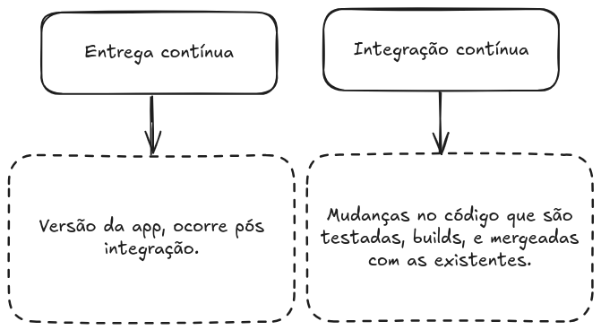

# Encontro 07 — CI/CD com GitHub Actions

---

**Duração:** 2h  
**Bloco:** Projeto Prático 2  
**Projeto associado:** `projeto-2-ec2-flask-cicd/`

---

## Objetivos do Encontro
- Entender o conceito de CI/CD e sua importância
- Configurar o pipeline do Projeto 2 (GitHub Actions)
- Realizar um deploy end-to-end automatizado: push → build → EC2
- Entender secrets e segurança em pipelines

---

## Roteiro (2h)

| Tempo       | Atividade                                                    |
| ----------- | ------------------------------------------------------------ |
| 0:00 – 0:10 | Revisão + dúvidas                                            |
| 0:10 – 0:40 | Exposição: CI/CD — conceitos e ferramentas                   |
| 0:40 – 1:00 | Walkthrough do deploy.yml do Projeto 2                       |
| 1:00 – 1:50 | Laboratório: configurar secrets + primeiro deploy automático |
| 1:50 – 2:00 | Síntese e revisão do Projeto 2                               |

---

## Conteúdo Expositivo

### 7.1 CI vs. CD

| Sigla  | Nome                   | O que faz                                   |
| ------ | ---------------------- | ------------------------------------------- |
| **CI** | Continuous Integration | Build + testes automáticos a cada push      |
| **CD** | Continuous Delivery    | Artefato sempre pronto para deploy (manual) |
| **CD** | Continuous Deployment  | Deploy automático em produção a cada push   |

---
**CI/CD**
- Detecta erros cedo (antes de chegar em produção)
- Elimina deploys manuais propensos a erro
- Feedback rápido para o desenvolvedor
- Histórico auditável de cada deploy

---
## O que é?

GitHub Actions é uma plataforma de integração e entrega contínua (CI/CD) que permite automatizar a sua compilação, testar e integrar sua pipeline de implantação. É possível criar fluxos de trabalho que criam e testam cada pull request no seu repositório, ou implantar pull requests mesclados em produção.

---
## CI/CD


---
## Visualizando


De maneira geral podemos seguir essa seguinte estrutura.

---
## O que compõe github actions


---
## Como é configurada?


Exemplo da action utilizada para servir esse material:
https://github.com/uiuqM/treinamento-devops-aws-iac-epic/blob/main/.github/workflows/main.yaml

---
## Visualizando


---
## Events (Workflow triggers)

| Relacionado ao repositório                  | Outros                                          |
| ------------------------------------------- | ----------------------------------------------- |
| push (commit)                               | workflow_dispatch<br>(trigger manual)           |
| pull_request (opened, closed...)            | repository_dispatch<br>(REST API)               |
| create (branch ou tag)                      | scheduled<br>(Workflow agendado)                |
| fork (repo teve fork)                       | workflow_call<br>(Chamado por outros workflows) |
| issues (issue aberta, deletada....)         |                                                 |
| issues_comment (issue ou PR comment)        |                                                 |
| watch (repo favoritado)                     |                                                 |
| discussion (dicussion criada, deletada ...) |                                                 |
| ....                                        |                                                 |

---

## Job runners



---
## Actions

Uma aplicação que performa uma tarefa (complexa) repetitiva.

Exemplos:
https://github.com/actions/checkout
https://github.com/marketplace?type=actions
---

### 7.2 GitHub Actions — Estrutura

```yaml
name: Nome do Workflow

on:                      
  push:
    branches: [main]

jobs:
  nome-do-job:
    runs-on: ubuntu-latest

    steps:
      - name: Checkout
        uses: actions/checkout@v4

      - name: Passo customizado
        run: echo "Olá do pipeline!"
```

---
### 7.3 Secrets no GitHub Actions

Nunca coloque credenciais diretamente no YAML. Use **Secrets**:

---

```yaml
# No YAML: referencie com ${{ secrets.NOME }}
- name: Deploy via SSH
  uses: appleboy/ssh-action@v1.0.0
  with:
    host: ${{ secrets.EC2_HOST }}
    key:  ${{ secrets.EC2_SSH_KEY }}
```

Configurar em: **GitHub → Repo → Settings → Secrets and variables → Actions**

---
### 8.4 Walkthrough do deploy.yml

```yaml
name: CI/CD — Build e Deploy em EC2

on:
  push:
    branches: [main]

jobs:
  build-and-deploy:
    runs-on: ubuntu-latest
    steps:
      - uses: actions/checkout@v4
      - name: Build da imagem Docker
        run: docker build -t flask-iac-app ./app
      - name: Deploy na EC2
        uses: appleboy/ssh-action@v1.0.0
        with:
          host:     ${{ secrets.EC2_HOST }}
          username: ec2-user
          key:      ${{ secrets.EC2_SSH_KEY }}
          script: |
            docker stop flask-app 2>/dev/null || true
            docker rm   flask-app 2>/dev/null || true
            cd /home/ec2-user/app
            git pull origin main
            docker build -t flask-iac-app ./projeto-2-ec2-flask-cicd/app
            docker run -d --name flask-app --restart unless-stopped \
              -p 5000:5000 -e APP_ENV=producao -e APP_COLOR=#1a1a2e \
              flask-iac-app
```

---

## Laboratório — Deploy Automático com GitHub Actions

### Passo 1: Subir a infraestrutura
```bash
cd terraform && terraform apply
# Anote o IP público da EC2
```

### Passo 2: Preparar a EC2 para o deploy automático
```bash
ssh -i ~/.ssh/id_rsa ec2-user@<IP>

# Clonar o repositório dentro da EC2
git clone https://github.com/SEU_USUARIO/SEU_REPO.git app
exit
```

### Passo 3: Configurar Secrets no GitHub
Acesse: **GitHub → Repo → Settings → Secrets and variables → Actions**

| Secret | Valor |
|--------|-------|
| `EC2_HOST` | IP público da EC2 (output do Terraform) |
| `EC2_SSH_KEY` | Conteúdo completo de `~/.ssh/id_rsa` (chave privada) |

```bash
# Para copiar a chave privada
cat ~/.ssh/id_rsa
# Cole todo o conteúdo (incluindo -----BEGIN e -----END-----)
```

### Passo 4: Fazer uma alteração e observar o pipeline
```python
# No app.py, altere a mensagem ou adicione uma rota nova
@app.route('/versao')
def versao():
    return {'versao': '2.0', 'encontro': 8}
```

```bash
git add . && git commit -m "feat: adiciona rota /versao"
git push origin main
```

Acompanhe em: **GitHub → Repo → Actions** → observe os steps em tempo real.

### Passo 5: Verificar o deploy
```bash
curl http://<IP>:5000/versao
# Deve retornar: {"versao": "2.0", "encontro": 8}
```

### Destruir ao final
```bash
cd terraform && terraform destroy
```

---

## Atividade para Casa
1. Adicione um step de **validação** antes do deploy: `terraform fmt -check` e `terraform validate`
2. Configure o pipeline para rodar também em Pull Requests (mas sem o step de deploy)
3. Pesquisa: o que é **GitHub Environments** e como adicionar aprovação manual antes do deploy em produção?

---

## Referências
- GitHub. *GitHub Actions Documentation.* https://docs.github.com/en/actions
- GitHub. *Encrypted Secrets.* https://docs.github.com/en/actions/security-guides/encrypted-secrets
- appleboy/ssh-action. https://github.com/appleboy/ssh-action
